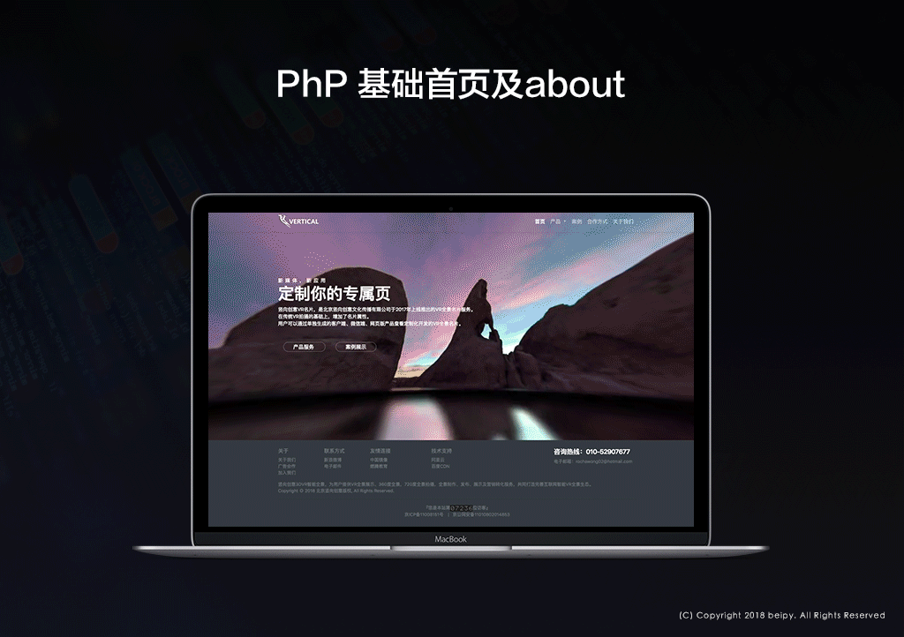

# php小企业官网板式

#### 项目介绍

#### 使用说明

### 界面欣赏
-----

**链接访问**

#### 采用的开源模块
- **Jquery**：js主流开发框架 [http://jquery.com/](http://jquery.com/)
- **Bootstrap**：主流响应式CSS框架[http://www.bootcss.com/](http://www.bootcss.com/)
- **animate**：主流css动画框架
#### 参与贡献
	@beipy

### 打赏
-----
- **支持项目继续完善下去，你也可以贡献一份力量！💰打赏，更会有更新的动力

### 更新日志
-----
#### 日期 `2018/6/29`
- 开源备份
